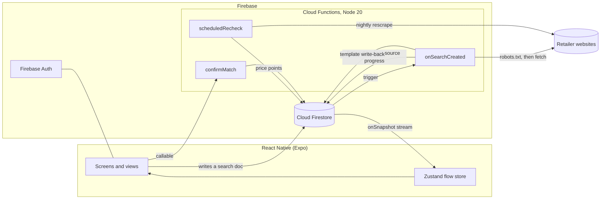
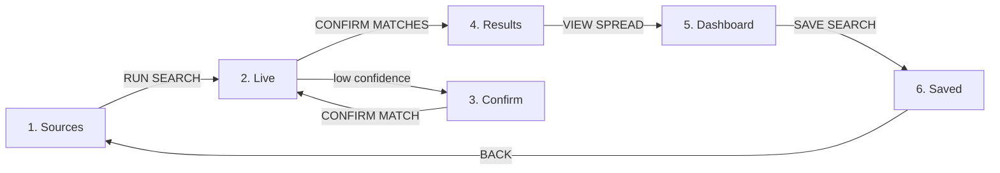
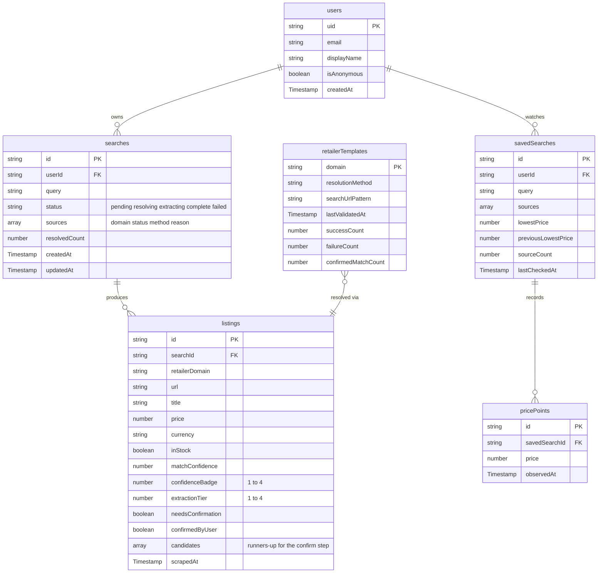

<div align="center">

# SIFT

**A landscape-first price comparison app that streams live scraped prices and teaches you what those prices mean.**

[](https://docs.expo.dev/versions/v57.0.0/)
[](https://reactnative.dev/)
[](https://react.dev/)
[](https://www.typescriptlang.org/)
[](https://firebase.google.com/)
[](https://nodejs.org/)
[](https://docs.docker.com/compose/)
[](https://cheerio.js.org/)
[](https://zustand.docs.pmnd.rs/)
[](https://docs.expo.dev/router/introduction/)

[](#5-run-the-app)
[](#landscape-support)
[](#testing)
[](LICENSE)
[](#project-status)

</div>

---

## Table of contents

- [Project overview](#project-overview)
- [Features](#features)
- [How it works](#how-it-works)
- [Technologies used](#technologies-used)
- [Installation](#installation)
- [Usage](#usage)
- [Data model](#data-model)
- [Testing](#testing)
- [Project structure](#project-structure)
- [Project status](#project-status)
- [Team and contributions](#team-and-contributions)
- [Acknowledgements](#acknowledgements)
- [Licence](#licence)

---

## Project overview

Price comparison sites only compare the retailers they have deals with. If a shop is not on the list, it does not exist as far as the comparison is concerned, and the shopper has no way to tell whether the price they are looking at is good.

SIFT inverts that. The user supplies the retailer sites they actually care about, SIFT works out where the product lives on each one, reads the price off the page and streams the results back as they land. Nothing is hardcoded to a retailer, so any site the user can name is a site SIFT will try.

### What makes it different

|                           |                                                                                                                                                          |
| ------------------------- | -------------------------------------------------------------------------------------------------------------------------------------------------------- |
| **User-supplied sources** | No fixed retailer list. Paste a domain and SIFT attempts it.                                                                                             |
| **Real-time streaming**   | Prices appear one at a time as each source resolves, driven by Firestore listeners rather than a refresh button.                                         |
| **Honest confidence**     | Every result carries an extraction tier and a match confidence. Low-confidence matches go to a confirm step instead of quietly being wrong.              |
| **Price literacy**        | The dashboard shows spread, history and where each retailer sits on the ladder, so the user learns what a good price is rather than just being told one. |
| **Landscape-first**       | Comparison is a horizontal problem. The core screens are designed for landscape, with a portrait layout for smaller devices.                             |

### Design constraints

The project is built against three fixed inspiration cards, and every major decision traces back to one of them.

| Card               | Drawn                 | How SIFT answers it                                                                                                   |
| ------------------ | --------------------- | --------------------------------------------------------------------------------------------------------------------- |
| Goal theme         | **Learn Something**   | Spread analysis, price history, tier and confidence badges. The user learns how to read a price, not just what it is. |
| Device interaction | **Real-Time Data**    | Firestore listeners stream scrape results and price drops as they happen.                                             |
| Constraint         | **Landscape Support** | A landscape rail plus content layout, with a portrait header for smaller devices. Rotation is allowed, not locked.    |

---

## Features

### Implemented

- **Source management.** Add retailer domains, see per-source status (`PENDING`, `RESOLVED`, `BLOCKED`) and remove sources that cannot be scraped.
- **Live results stream.** Result tiles arrive one per source as each resolves, with a scanning sweep and a live progress bar.
- **Confirm matches.** When match confidence drops below threshold, the user picks the right listing from candidate cards instead of getting the wrong product.
- **Results grid.** Every resolved listing with price, retailer, extraction tier and confidence, lowest price flagged.
- **Spread dashboard.** Price ladder, spread percentage, history bars and insight cards.
- **Saved searches.** Watch a search, check it for movement and get a price-drop note when it falls.
- **Alert log.** Blocked sources, confirm prompts and price drops surface as dismissible banners and archive to a session log.
- **Landscape and portrait layouts.** A vertical rail in landscape, a compact header bar in portrait, switched on `useWindowDimensions`.
- **Extraction pipeline.** JSON-LD, Open Graph, microdata and heuristic HTML parsing, covered by unit tests against real and synthetic fixtures.
- **Headless rendering fallback.** A client-rendered storefront is rendered in a real headless Chromium browser before the same parsers run against the result, reached only once the plain-fetch tiers have both failed.
- **Full resolution cascade.** Registry lookup, generic search-form discovery, platform fingerprinting for nine ecommerce platforms, and a user-pasted search URL as the last resort. Everything discovered is written back to the shared registry.
- **Match confidence scoring.** Query tokens containing digits are weighted double, since those separate a variant from its siblings, and accessory listings are penalised. Below 60% the user is asked to pick.
- **Server-side pipeline.** A Firestore trigger resolves, fetches, extracts and scores every source, four at a time with one request per host, republishing per-source state as each one lands.
- **Politeness layer.** robots.txt is fetched and obeyed before any request, cached per origin, with per-host rate limiting and an honest user agent.
- **Anonymous auth with guest upgrade.** A first search needs no account. An email can be attached later without changing the uid, so saved searches survive.
- **Scheduled price rechecks.** Watched searches are rescraped nightly, each check appending a price point that the dashboard history bars read back.

### Planned

- Extraction tiers 1 and 2, official APIs and internal JSON endpoints (stubbed, per-retailer work)
- Push notifications on price drops
- Selection weighting, where the candidate a user confirms informs future ranking
- EAS Build and submission to the App Store and Play Store

---

## How it works

React Native cannot scrape arbitrary websites from the device. CORS, JavaScript-rendered pages, bot detection and mobile CPU all block it. Scraping therefore lives server-side in Cloud Functions, which write to Firestore, and the app subscribes to a real-time listener.



The pipeline is deliberately split in two. Resolution answers _which page_, extraction answers _what is on it_. Conflating them produces a scraper that only works if the user already found the product themselves.

### Stage 1: resolution

| Order | Method                                                            |   Status    |
| :---: | ----------------------------------------------------------------- | :---------: |
|   A   | Stored registry template for a known domain                       | Implemented |
|   B   | Generic search form discovery on the homepage                     | Implemented |
|   C   | Known ecommerce platform patterns (Shopify, WooCommerce, Magento) | Implemented |
|   D   | Ask the user to paste a search URL once                           | Implemented |

Nothing in this stage commits to an answer. Each method only proposes a URL; the homepage is fetched once and every method reads from that single response. The pipeline then tries the proposed URLs in order and accepts the first that actually yields prices matching the query. Only then is the template written back to the registry, so a route that looked plausible but returned a category page never poisons the next search.

That validation is what makes the write-back safe, and it is measurable: the first search against a new domain resolves by fingerprint, the second resolves by `registry` and returns faster.

### Stage 2: extraction cascade

| Tier | Source                                          |        Status        |
| :--: | ----------------------------------------------- | :------------------: |
|  1   | Official retailer API                           | Future consideration |
|  2   | Undocumented internal JSON endpoint             | Future consideration |
|  3   | Structured data: JSON-LD, Open Graph, microdata |     Implemented      |
|  4   | Heuristic HTML parsing                          |     Implemented      |
|  5   | Headless render, then tiers 3-4 against the result |   Implemented      |

Tiers 3-5 are fully generic and need no per-retailer configuration, which is what keeps the any-site promise intact. Tier 5 is the most expensive rung on the ladder, a real headless Chromium browser rather than a fetch, so it only runs once tiers 3 and 4 have both come back empty and the page looks client-rendered. Tiers 1 and 2 are per-retailer work that scales badly, so they are scoped out of the MVP and stubbed in place.

> [!IMPORTANT]
> **Where the scraper runs decides whether it works.** This is the single biggest constraint on the project, and it is not a code problem.
>
> The same query, the same code, the same rules, run against `geekhome.co.za`:
>
> | Egress | Result |
> | --- | --- |
> | Home connection, via the local emulator suite | `form-discovery`, 12 candidates, top match **100%**, `MTG Teenage Mutant Ninja Turtles Bundle` at **R2 300**, in 2 seconds |
> | Cloud Functions in `europe-west1` | TCP reset. `The site refused the connection` |
>
> Small retailers block foreign and datacentre traffic outright, and Cloudflare returns `403` to the same ranges. So **run the emulator suite locally to scrape South African retailers**, which is what `docker compose up` is for. The deployed functions still serve everything else, and everything except the outbound request behaves identically either way.

> [!NOTE]
> **Known limitations, measured against live sites.** Tiers 3 and 4 read HTML. Four things stop that working, and all four were hit against real retailers rather than found in theory.
>
> | Limitation | What happens | The fix, and where it sits |
> | --- | --- | --- |
> | Client-rendered storefronts | The page is a JavaScript shell with no search form and no prices. Most large South African retailers are built this way. | Tier 5 headless rendering, implemented. Costs a browser rather than a fetch, so it only runs as the last resort |
> | Datacentre IP blocking | `403` from Cloudflare, or a TCP reset, for a request that succeeds from a home connection. | Run the pipeline locally, as above. Applies to the headless render too |
> | robots.txt on search paths | Many storefronts allow `/` and disallow `/search`. That is a refusal, and SIFT honours it. | Nothing to fix. The source is reported `BLOCKED` |
> | Niche catalogues | The shop simply does not stock the product, and its search returns unrelated items. | Nothing to fix. Reported as such rather than as a failure |
>
> Each is reported by name rather than as a generic failure, because "the site refused us from a datacentre", "the site is slow", "that domain does not exist" and "this shop does not stock it" need four different responses from the user.

### Scraping ethics

Every outbound request goes through one function in [`functions/src/net/fetchPage.ts`](functions/src/net/fetchPage.ts). It fetches `robots.txt` first, caches it per origin for an hour, and refuses any disallowed path outright. Requests are limited to one at a time per host and four hosts at once, with a ten second timeout. SIFT identifies itself as `SiftBot` rather than spoofing a browser user agent. Official retailer APIs are preferred wherever they exist.

Two details matter more than they look:

- **A redirect can change the policy.** An apex domain that allows everything often redirects to a `www` host whose `robots.txt` is stricter. The policy that binds is the one on the host actually serving the content, so it is rechecked after the redirect.
- **One refused path is not a refused site.** Storefronts commonly allow `/` and disallow `/search`. That rules out one guessed route, not the domain, so the cascade continues and a source is only marked `BLOCKED` once every route it has was refused.

---

## Technologies used

| Layer           | Choice                                         | Why                                                                         |
| --------------- | ---------------------------------------------- | --------------------------------------------------------------------------- |
| Language        | TypeScript 6 (strict)                          | One language across app and functions, with shared Firestore document types |
| Framework       | React Native 0.86 via Expo SDK 57              | Single codebase for iOS, Android and web                                    |
| Navigation      | Expo Router                                    | File-based routing with typed routes                                        |
| State           | Zustand                                        | Small store, no Redux boilerplate                                           |
| Orientation     | expo-screen-orientation                        | Landscape lock, with `useWindowDimensions` driving layout switching         |
| Typography      | Big Shoulders Display, JetBrains Mono, Archivo | Display, data and longform roles kept visually distinct                     |
| Graphics        | react-native-svg, expo-linear-gradient         | Dot matrix, sweeps, ladders and charts                                      |
| Motion          | react-native-reanimated 4                      | Scan sweep and streaming transitions                                        |
| Auth            | Firebase Auth                                  | Persisted to AsyncStorage on device                                         |
| Database        | Cloud Firestore                                | NoSQL with real-time listeners, which the Real-Time Data card demands       |
| Backend runtime | Cloud Functions v2 on Node 20                  | Server-side scraping on the Blaze plan with a budget cap                    |
| HTML parsing    | Cheerio                                        | Fast server-side DOM traversal for tiers 3 and 4                            |
| Headless rendering | playwright-core, @sparticuz/chromium        | Tier 5: renders client-rendered pages before tiers 3-4 parse the result     |
| Politeness      | robots-parser, p-limit                         | robots.txt compliance and concurrency limiting                              |
| Admin writes    | firebase-admin                                 | Listings and templates are function-written only                            |
| Local dev       | Firebase Emulator Suite in Docker Compose      | Reproducible backend with no cloud spend                                    |
| Testing         | `node:test` with ts-node                       | Extraction parsers tested against HTML fixtures                             |
| Linting         | ESLint 9 with eslint-config-expo               | Flat config                                                                 |
| Store builds    | EAS Build and EAS Submit                       | Planned for App Store and Play Store release                                |

---

## Installation

### Prerequisites

| Tool           | Version | Notes                                                         |
| -------------- | ------- | ------------------------------------------------------------- |
| Node.js        | 20 LTS  | Functions pin Node 20, so match it locally                    |
| npm            | 10+     | Ships with Node 20                                            |
| Docker Desktop | Latest  | Runs the Firebase Emulator Suite. Only needed for the backend |
| Git            | Any     |                                                               |
| Expo Go        | Latest  | On a phone, if testing on a physical device                   |
| Java 17 JRE    | -       | Only if running the emulators outside Docker                  |

Xcode is needed for the iOS simulator (macOS only) and Android Studio for the Android emulator. Neither is required if you test in a browser or in Expo Go.

### 1. Clone and install

```bash
git clone https://github.com/KeaganCB-OW/SIFT.git
```

```bash
cd SIFT && npm install && npm install --prefix functions
```

### 2. Environment variables

Copy the example file and fill in your Firebase web app config from **Firebase Console, Project settings, Your apps**.

```bash
cp .env.example .env
```

On Windows PowerShell:

```bash
Copy-Item .env.example .env
```

```env
EXPO_PUBLIC_FIREBASE_API_KEY=
EXPO_PUBLIC_FIREBASE_AUTH_DOMAIN=
EXPO_PUBLIC_FIREBASE_PROJECT_ID=
EXPO_PUBLIC_FIREBASE_STORAGE_BUCKET=
EXPO_PUBLIC_FIREBASE_MESSAGING_SENDER_ID=
EXPO_PUBLIC_FIREBASE_APP_ID=

# Point the app at the emulator suite rather than the real project
EXPO_PUBLIC_USE_FIREBASE_EMULATOR=false
```

> [!TIP]
> With `EXPO_PUBLIC_FIREBASE_API_KEY` and `EXPO_PUBLIC_FIREBASE_PROJECT_ID` blank the app runs on its seeded dataset, so every screen is navigable **without** any Firebase credentials. Fill them in to get live scraping, accounts and watches. The account panel, opened from the session code, tells you which mode you are in.

### 3. Database and backend (Docker)

The emulator suite gives you Firestore, Auth and Functions locally with no cloud project and no billing. It is also the **only** way to scrape retailers that refuse datacentre traffic, since requests then leave through your own connection.

Set this in `.env` to point the app at it:

```env
EXPO_PUBLIC_USE_FIREBASE_EMULATOR=true
```

The image installs JDK 21 from Adoptium, because firebase-tools 15 refuses anything older, and the emulators bind to `0.0.0.0` so the published ports are reachable from the host.

```bash
docker compose up
```

| Service     | Port | URL                   |
| ----------- | :--: | --------------------- |
| Emulator UI | 4000 | http://localhost:4000 |
| Functions   | 5001 | http://localhost:5001 |
| Firestore   | 8080 | http://localhost:8080 |
| Auth        | 9099 | http://localhost:9099 |

Firestore rules and indexes are applied from `firestore.rules` and `firestore.indexes.json` on start, and emulator state is exported on exit so seeded data survives a restart.

<details>
<summary><b>Running the emulators without Docker</b></summary>

Install the Firebase CLI and a Java 17 JRE, then:

```bash
npm install -g firebase-tools
```

```bash
cd functions && npm run serve
```

`npm run serve` builds the TypeScript and starts the functions emulator. Use `firebase emulators:start` from the repo root for the full suite.

</details>

<details>
<summary><b>Working on the Cloud Functions</b></summary>

Run the compiler in watch mode in one terminal while the emulators run in another.

```bash
cd functions && npm run build:watch
```

Other scripts: `npm run shell` for an interactive functions shell, `npm run logs` for deployed logs, `npm run deploy` to push to the project named in `.firebaserc`.

</details>

### 4. Deploying to a real Firebase project (optional)

Only needed if you want the app running against live Firebase rather than the emulators.

```bash
firebase login
```

```bash
firebase use --add
```

```bash
firebase deploy --only firestore:rules,firestore:indexes,functions
```

> [!IMPORTANT]
> Cloud Functions make outbound requests to retailer sites, which the Firebase free tier does not allow. The project needs the **Blaze** plan with a budget cap configured.

### 5. Run the app

```bash
npx expo start
```

Then choose a target:

| Environment                   | Command                                | Notes                                                                              |
| ----------------------------- | -------------------------------------- | ---------------------------------------------------------------------------------- |
| **Web (quickest for review)** | `npm run web`                          | Opens on http://localhost:8081. Resize the window wide to see the landscape layout |
| **Android emulator**          | `npm run android`                      | Needs Android Studio with a device image                                           |
| **iOS simulator**             | `npm run ios`                          | macOS with Xcode only                                                              |
| **Physical device**           | `npx expo start` then scan the QR code | Needs Expo Go and the phone on the same network                                    |

<details>
<summary><b>Lecturer quick start: no Firebase account, no Docker, about two minutes</b></summary>

```bash
git clone https://github.com/KeaganCB-OW/SIFT.git
```

```bash
cd SIFT && npm install && npm run web
```

The seeded dataset drives the full six-screen flow, so the whole app is reviewable from the browser with no backend running. Widen the window past 768px for the landscape layout. To see the backend as well, add `docker compose up` in a second terminal.

</details>

<details>
<summary><b>Troubleshooting</b></summary>

| Symptom                                       | Fix                                                                                                                       |
| --------------------------------------------- | ------------------------------------------------------------------------------------------------------------------------- |
| Metro cache errors after dependency changes   | `npx expo start --clear`                                                                                                  |
| Fonts render as system default                | Wait for the splash screen to finish; fonts load asynchronously through `expo-font`                                       |
| Ports 4000, 5001, 8080 or 9099 already in use | Stop other Firebase emulators, or change the ports in `docker-compose.yml` and `firebase.json`                            |
| Physical device cannot reach Metro            | Put the phone on the same Wi-Fi network, or run `npx expo start --tunnel`                                                 |
| Portrait layout not appearing                 | Narrow the window below 768px on web, or rotate the device. Layout follows the window shape, not a lock                  |
| `firebase/auth` type error in the editor      | Known and suppressed. `getReactNativePersistence` is resolved by Metro's `react-native` export condition but not by `tsc` |

</details>

---

## Usage

The app is a six-screen flow, driven by the `RUN SEARCH` primary action and a persistent action bar. The bar's primary button always advances the flow, the secondary always goes back, and the status line on the right reports live state.



### 1. Add sources

Type a product query, then add the retailer domains to search. Pasted URLs are stripped back to the bare domain. Each source shows its status, and a `BLOCKED` source must be removed before the search can run. Recent searches are one tap away.

### 2. Live results

Result tiles stream in one per source as it resolves. The rail shows a `LIVE` indicator, the status line counts resolved sources, and any tile that matched below confidence threshold is flagged for review. Selecting a tile opens its listing detail: URL, resolution method, stock, price position relative to the lowest, and the confidence score out of four.

### 3. Confirm matches

Where confidence was low, candidate listings are shown side by side with title, price and confidence. Picking one rewrites that tile in place and clears the review prompt into the alert log. This is what stops the app confidently comparing the wrong product.

### 4. Results

Every resolved listing in one grid, lowest price flagged, each tile carrying its extraction tier and confidence badge.

### 5. Dashboard

The spread view. A price ladder positions every retailer between cheapest and dearest, the spread percentage quantifies the gap, history bars show recent movement and insight cards explain what the numbers mean. This screen carries the Learn Something goal.

### 6. Saved searches

Watch a search and check it later. If the price has fallen, the item shows its old and new value and a `PRICE_DROP` note appears with the percentage. `CHECK ALL` runs every watched item at once.

### Alerts

Blocked sources, confirm prompts and price drops appear as banners tagged by sigil: `//` informational, `>` action needed, `!` problem. Dismissing a banner archives it to the session alert log, reachable from the action bar.

### Landscape support

In landscape a 56px vertical rail carries the screen name, connection state, source count and session code, with the saved-searches strip beside it. In portrait that collapses to a horizontal header bar and the content reflows to a single column. Layout is chosen from `useWindowDimensions`, so both orientations ship rather than one being locked out.

---

## Data model

Firestore, six collections. Shared TypeScript interfaces live in [`src/types/firestore.ts`](src/types/firestore.ts) for the client and [`functions/src/types/index.ts`](functions/src/types/index.ts) for the backend.



Security rules in [`firestore.rules`](firestore.rules) scope `users`, `searches` and `savedSearches` to their owner. A search is create-then-read-only for the client, since everything after creation is written by the pipeline. `listings` are readable only by the owner of their parent search and never client-writable, so the confirm step has to go through the callable. `retailerTemplates` are readable by any signed-in user, because that is the point of write-back: a site solved once is solved for everyone after.

Composite indexes back the sorted listing query, both per-user listings, and the price history series.

---

## Testing

Scraping is the part most likely to break silently, so it is covered by 49 tests against twelve HTML fixtures, including a real retailer page saved from `books.toscrape.com` and a client-rendered page with no prices in the markup.

```bash
npm test --prefix functions
```

| Suite | Covers |
| --- | --- |
| `extraction` | JSON-LD products, products nested in `@graph`, Open Graph price meta, microdata, heuristic parsing with no price class, candidate extraction from an `ItemList` and from repeated cards, and correct `null` returns when a page carries nothing extractable |
| `resolution` | Search-form discovery including hidden scope fields and skipped POST forms, platform fingerprinting, template building and validation, and turning a user-pasted URL into a reusable template |
| `matching` | Exact matches, wrong storage variants, accessories that match the query word for word, and the confidence-to-badge mapping |
| `net` | Telling a mistyped domain, a refused connection, a certificate problem and a genuine timeout apart, and the www fallback for three-label ccTLD domains |
| `pipeline` | The whole scrape end to end against a local HTTP server: robots.txt fetched first and obeyed (including after a redirect to a stricter host), the search URL derived from the homepage, a URL that just returns the homepage rejected, the results page parsed, and each failure mode reporting its own reason |

The pipeline suite runs without Firebase, which also proves the registry degrades rather than throwing when Firestore is unavailable.

Lint the app with:

```bash
npm run lint
```

---

## Project structure

```
SIFT/
├── src/
│   ├── app/                   Expo Router screens (_layout, index)
│   ├── components/sift/       23 design-system components
│   │   └── views/             The six screen views
│   ├── constants/
│   │   ├── sift-theme.ts      Design tokens, single source of truth
│   │   └── sift-mock-data.ts  Seeded dataset driving the UI
│   ├── hooks/
│   │   ├── use-sift-flow.ts   View model: derived UI state and actions
│   │   ├── use-auth.ts        Anonymous sign-in and guest upgrade
│   │   ├── session/           Live Firestore session and seeded demo session
│   │   ├── use-orientation.ts
│   │   └── use-orientation-policy.ts
│   ├── lib/                   Firebase client, Firestore queries, doc-to-view mappers
│   ├── store/                 Zustand flow store (UI state only)
│   └── types/                 Firestore document types and view model types
├── functions/src/
│   ├── net/                   robots.txt, rate limiting, the single outbound fetch
│   ├── resolution/            Stage 1: registry, form discovery, platform patterns
│   ├── extraction/            Stage 2: the four-tier cascade and candidate extraction
│   ├── matching/              Match confidence scoring
│   ├── pipeline/              Search orchestration, confirm-match, scheduled rechecks
│   ├── types/                 Shared backend types
│   └── index.ts               Function exports
├── assets/                    Icons, splash, tab imagery
├── docker-compose.yml         Emulator suite
├── Dockerfile.emulators       Node 20, Java 17, firebase-tools
├── firebase.json              Emulator ports, rules, function config
├── firestore.rules            Security rules
└── firestore.indexes.json     Composite indexes
```

### Design system

Every colour, size, font and duration comes from [`src/constants/sift-theme.ts`](src/constants/sift-theme.ts). Components never hardcode a hex or a pixel value.

| Token group   | Contents                                                                                                  |
| ------------- | --------------------------------------------------------------------------------------------------------- |
| `SiftColors`  | Neutrals (`void`, `carbon`, `slate`, `graphite`, `bone`) and signals (`mint`, `acid`, `ember`, `current`) |
| `SiftTier`    | Tier-to-colour mapping, so extraction quality is legible at a glance                                      |
| `SiftType`    | Display, price, body, title, label and annotation roles                                                   |
| `SiftSpacing` | A 4px scale plus rail, strip and prompt-bar dimensions                                                    |
| `SiftRadius`  | Fixed at `0`. A hard rule, never overridden                                                               |
| `SiftMotion`  | Instant, snap, sweep and sequence durations with a shared entry easing                                    |
| `SiftMatrix`  | Dot matrix pitch and density presets                                                                      |

Status is never carried by colour alone. Every tier badge, source chip and alert banner also carries a text label or sigil.

---

## Project status

| Area                                     |        State         |
| ---------------------------------------- | :------------------: |
| Design system and tokens                 |       Complete       |
| Six screens, landscape and portrait      |       Complete       |
| Flow state machine and Zustand store     |       Complete       |
| Resolution methods A to D                |   Complete, tested   |
| Extraction tiers 3 and 4                 |   Complete, tested   |
| Extraction tier 5, headless rendering    |   Complete, tested   |
| Match confidence and confirm step        |   Complete, tested   |
| Politeness: robots.txt and rate limiting |   Complete, tested   |
| Search pipeline and real-time streaming  |       Complete       |
| Scheduled saved-search rechecks          |       Complete       |
| Firebase Auth with guest upgrade         |       Complete       |
| Frontend wired to live Firestore         |       Complete       |
| Deployed and verified against live sites |       Complete       |
| Firestore schema, rules, indexes         |       Complete       |
| Docker emulator environment              |       Complete       |
| EAS build profiles                       |       Complete       |
| Extraction tiers 1 and 2                 | Future consideration |
| Push notifications on price drops        |       Planned        |
| Store submission                         |       Planned        |

---

## Team and contributions

| Contributor                                                         | Role                        | Contributions                                                                                                                                                                                                                                                                        |
| ------------------------------------------------------------------- | --------------------------- | ------------------------------------------------------------------------------------------------------------------------------------------------------------------------------------------------------------------------------------------------------------------------------------ |
| **Keagan Boucher** ([@KeaganCB-OW](https://github.com/KeaganCB-OW)) | Sole developer and designer | Concept and pitch, SIFT design system and tokens, all six screens and 23 components, flow state machine, landscape and portrait layouts, Firestore schema and security rules, resolution and extraction pipelines, extraction test suite, Docker emulator environment, documentation |

### Contributing

Work happens on `main` with focused commits per unit of work. If you are extending the project, keep the split: resolution logic in `functions/src/resolution/`, extraction logic in `functions/src/extraction/`, and every visual value sourced from `sift-theme.ts`.

---

## Acknowledgements

**Documentation and references**

- [Expo SDK 57 documentation](https://docs.expo.dev/versions/v57.0.0/), the versioned reference this project is built against
- [Expo Router](https://docs.expo.dev/router/introduction/) for file-based navigation
- [React Native](https://reactnative.dev/docs/getting-started)
- [Firebase documentation](https://firebase.google.com/docs), particularly [Firestore data modelling](https://firebase.google.com/docs/firestore/data-model), [security rules](https://firebase.google.com/docs/firestore/security/get-started) and the [Emulator Suite](https://firebase.google.com/docs/emulator-suite)
- [Cloud Functions for Firebase, 2nd gen](https://firebase.google.com/docs/functions)
- [Cheerio](https://cheerio.js.org/) for server-side HTML parsing
- [Zustand](https://zustand.docs.pmnd.rs/) for state management
- [schema.org/Product](https://schema.org/Product) and the [Open Graph protocol](https://ogp.me/), which define the structured data tier 3 reads

**Libraries and tooling**

- [robots-parser](https://github.com/samclarke/robots-parser) and [p-limit](https://github.com/sindresorhus/p-limit) for polite, rate-limited scraping
- [React Native Reanimated](https://docs.swmansion.com/react-native-reanimated/) and [react-native-svg](https://github.com/software-mansion/react-native-svg) by Software Mansion
- [Firebase Emulator Suite](https://firebase.google.com/docs/emulator-suite) running in [Docker Compose](https://docs.docker.com/compose/)

**Typefaces**, all served through [Google Fonts](https://fonts.google.com/) via `@expo-google-fonts`

- [Big Shoulders Display](https://fonts.google.com/specimen/Big+Shoulders+Display) by Patric King, Occupant Fonts
- [JetBrains Mono](https://fonts.google.com/specimen/JetBrains+Mono) by JetBrains
- [Archivo](https://fonts.google.com/specimen/Archivo) by Omnibus-Type

**Test fixtures**

- [books.toscrape.com](https://books.toscrape.com/), a sandbox published explicitly for scraping practice. Used for the real-page extraction fixture so no live retailer is hit during testing.

**Guidance**

- Tsungai Katsuro and William Basson for there continued guidance and critique of this project.
- The project was scaffolded from the Expo default template, which is why the [MIT licence](LICENSE) retains 650 Industries' copyright notice

---

## Licence

Released under the [AGPLv3 Licence](LICENSE).

<div align="center">


</div>
