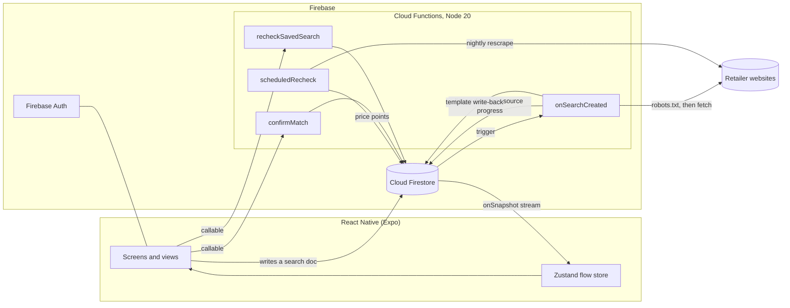
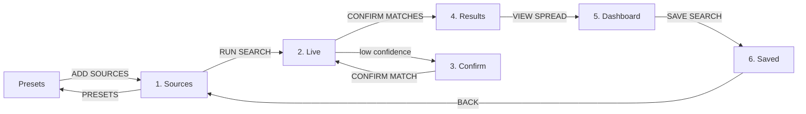
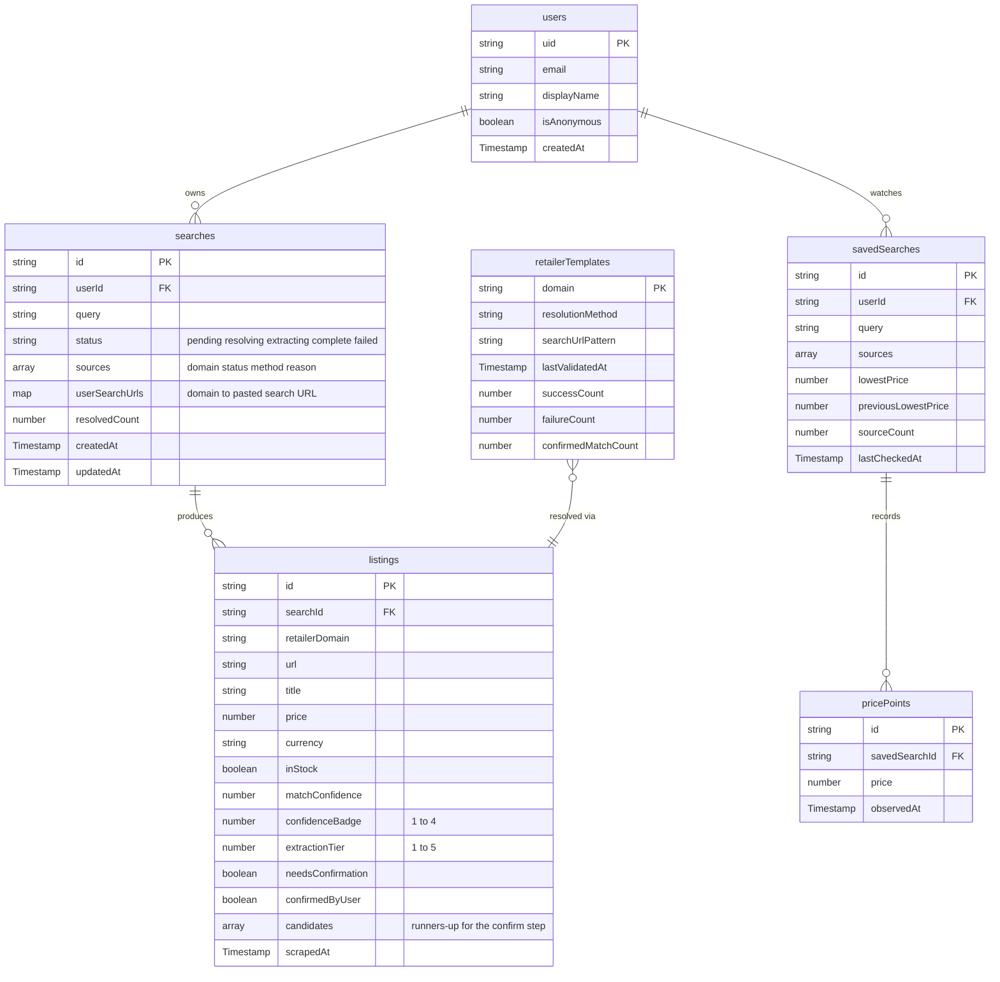

<div align="center">

# SIFT

**A landscape-first price comparison app that streams live scraped prices and teaches you what those prices mean.**

[](https://docs.expo.dev/versions/v57.0.0/)
[](https://reactnative.dev/)
[](https://react.dev/)
[](https://www.typescriptlang.org/)
[](https://firebase.google.com/)
[](https://nodejs.org/)
[](https://docs.docker.com/compose/)
[](https://cheerio.js.org/)
[](https://zustand.docs.pmnd.rs/)
[](https://docs.expo.dev/router/introduction/)

[](#5-run-the-app)
[](#landscape-support)
[](#testing)
[](LICENSE)
[](#project-status)

</div>

---

## Table of contents

- [Project overview](#project-overview)
- [Features](#features)
- [How it works](#how-it-works)
- [Technologies used](#technologies-used)
- [Installation](#installation)
- [Usage](#usage)
- [Data model](#data-model)
- [Testing](#testing)
- [Project structure](#project-structure)
- [Project status](#project-status)
- [Team and contributions](#team-and-contributions)
- [Acknowledgements](#acknowledgements)
- [Licence](#licence)

---

## Project overview

Price comparison sites only compare the retailers they have deals with. If a shop is not on the list, it does not exist as far as the comparison is concerned, and the shopper has no way to tell whether the price they are looking at is good.

SIFT inverts that. The user supplies the retailer sites they actually care about, SIFT works out where the product lives on each one, reads the price off the page and streams the results back as they land. Nothing is hardcoded to a retailer, so any site the user can name is a site SIFT will try.

### What makes it different

|                           |                                                                                                                                                          |
| ------------------------- | -------------------------------------------------------------------------------------------------------------------------------------------------------- |
| **User-supplied sources** | No fixed retailer list. Paste a domain and SIFT attempts it.                                                                                             |
| **Real-time streaming**   | Prices appear one at a time as each source resolves, driven by Firestore listeners rather than a refresh button.                                         |
| **Honest confidence**     | Every result carries an extraction tier and a match confidence. Low-confidence matches go to a confirm step instead of quietly being wrong.              |
| **Price literacy**        | The dashboard shows spread, history and where each retailer sits on the ladder, so the user learns what a good price is rather than just being told one. |
| **Landscape-first**       | Comparison is a horizontal problem. The core screens are designed for landscape, with a portrait layout for smaller devices.                             |

### Design constraints

The project is built against three fixed inspiration cards, and every major decision traces back to one of them.

| Card               | Drawn                 | How SIFT answers it                                                                                                   |
| ------------------ | --------------------- | --------------------------------------------------------------------------------------------------------------------- |
| Goal theme         | **Learn Something**   | Spread analysis, price history, tier and confidence badges. The user learns how to read a price, not just what it is. |
| Device interaction | **Real-Time Data**    | Firestore listeners stream scrape results and price drops as they happen.                                             |
| Constraint         | **Landscape Support** | A landscape rail plus content layout, with a portrait header for smaller devices. Rotation is allowed, not locked.    |

---

## Features

### Implemented

- **Source management.** Add retailer domains, see per-source status (`PENDING`, `KNOWN`, `RESOLVED`, `BLOCKED`, `FAILED`) and remove sources that cannot be scraped. A domain already solved in the shared registry is flagged `KNOWN` before the search runs, so the user knows it needs no resolving.
- **Source presets.** A curated category menu, reached from the toolbar beside `SAVED`. Categories cascade open to the domains they hold, and `ADD SOURCES` stages the lot into `//SOURCES` in one tap. Curated by hand in [`src/lib/presets.ts`](src/lib/presets.ts).
- **Live results stream.** Result tiles arrive one per source as each resolves, with a scanning sweep and animated running dots while the pipeline works.
- **Confirm matches.** When match confidence drops below threshold, the user picks the right listing from candidate cards instead of getting the wrong product. If nothing a source returned is right, it can be discarded from the run behind a confirmation prompt, leaving every other source untouched.
- **Results grid.** Every resolved listing with price, retailer, extraction tier and confidence, lowest price flagged.
- **Spread dashboard.** Price ladder, spread percentage, history bars and insight cards. Every axis point and ladder row opens its listing detail, and the listing's URL opens the product in the device browser.
- **Saved searches.** Watch a search, check it for movement and get a price-drop note when it falls. Past searches list one row per run, and tapping one restores its query and restages the domains it used.
- **Alert log.** Blocked sources, confirm prompts and price drops surface as dismissible banners and archive to a session log.
- **Landscape and portrait layouts.** A vertical rail in landscape, a compact header bar in portrait, switched on `useWindowDimensions`. Landscape also hides the Android status and navigation bars, so the rail owns the edge rather than sharing it with system chrome.
- **Splash and auth gate.** A boot screen runs the scan sweep while Firebase restores a persisted session, times out rather than hanging on an unreachable backend, and hands off to a login/signup gate or straight into the app.
- **Extraction pipeline.** JSON-LD, Open Graph, microdata and heuristic HTML parsing, covered by unit tests against real and synthetic fixtures.
- **Headless rendering fallback.** A client-rendered storefront is rendered in a real headless Chromium browser before the same parsers run against the result, reached only once the plain-fetch tiers have both failed.
- **Full resolution cascade.** Registry lookup, generic search-form discovery, platform fingerprinting for nine ecommerce platforms, and a user-pasted search URL as the last resort. Everything discovered is written back to the shared registry.
- **Paste-a-search-URL recovery.** A `FAILED` source's alert carries a `PASTE URL` action. The pasted URL is staged rather than fired immediately, so every failed source can be given one before a single retry runs, and the staged set is collapsed behind its own `LINKS [n]` panel in the action bar.
- **Match confidence scoring.** Query tokens containing digits are weighted double, since those separate a variant from its siblings, and accessory listings are penalised. Below 60% the user is asked to pick.
- **Server-side pipeline.** A Firestore trigger resolves, fetches, extracts and scores every source, four at a time with one request per host, republishing per-source state as each one lands.
- **Politeness layer.** robots.txt is fetched and obeyed before any request, cached per origin, with per-host rate limiting and an honest user agent.
- **Anonymous auth with guest upgrade.** A first search needs no account. An email can be attached later without changing the uid, so saved searches survive.
- **Scheduled price rechecks.** Watched searches are rescraped nightly, each check appending a price point that the dashboard history bars read back.

### Planned

- Extraction tiers 1 and 2, official APIs and internal JSON endpoints (stubbed, per-retailer work that scales badly, so deliberately scoped out)
- Submission to the App Store and Play Store. EAS build profiles exist in `eas.json`; no store build has been submitted

---

## How it works

React Native cannot scrape arbitrary websites from the device. CORS, JavaScript-rendered pages, bot detection and mobile CPU all block it. Scraping therefore lives server-side in Cloud Functions, which write to Firestore, and the app subscribes to a real-time listener.



Six functions deploy. `onSearchCreated` is the Firestore trigger that does the work; `confirmMatch` and `recheckSavedSearch` are callables the app invokes directly; `scheduledRecheck` is the nightly cron. `resolveListingUrl` and `extractListing` are single-stage callables exposed for testing one half of the pipeline in isolation, not used by the app's main flow.

Five of the six sit in `africa-south1` alongside Firestore, which a Firestore trigger requires and which puts every read and write in-region. `scheduledRecheck` is the exception: **Cloud Scheduler has no Johannesburg presence** and rejects the region outright, so the cron runs from `europe-west1`. That costs cross-region Firestore reads once a night, and unlike `onSearchCreated` it is not a Firestore trigger, so nothing obliges it to sit with the database. Its schedule stays on `Africa/Johannesburg` time regardless of where it runs.

The pipeline is deliberately split in two. Resolution answers _which page_, extraction answers _what is on it_. Conflating them produces a scraper that only works if the user already found the product themselves.

### Stage 1: resolution

| Order | Method                                                            |   Status    |
| :---: | ----------------------------------------------------------------- | :---------: |
|   A   | Stored registry template for a known domain                       | Implemented |
|   B   | Generic search form discovery on the homepage                     | Implemented |
|   C   | Known ecommerce platform patterns (Shopify, WooCommerce, Magento) | Implemented |
|   D   | Ask the user to paste a search URL once                           | Implemented |

Nothing in this stage commits to an answer. Each method only proposes a URL; the homepage is fetched once and every method reads from that single response. The pipeline then tries the proposed URLs in order and accepts the first that actually yields prices matching the query. Only then is the template written back to the registry, so a route that looked plausible but returned a category page never poisons the next search.

That validation is what makes the write-back safe, and it is measurable: the first search against a new domain resolves by fingerprint, the second resolves by `registry` and returns faster.

### Stage 2: extraction cascade

| Tier | Source                                          |        Status        |
| :--: | ----------------------------------------------- | :------------------: |
|  1   | Official retailer API                           | Future consideration |
|  2   | Undocumented internal JSON endpoint             | Future consideration |
|  3   | Structured data: JSON-LD, Open Graph, microdata |     Implemented      |
|  4   | Heuristic HTML parsing                          |     Implemented      |
|  5   | Headless render, then tiers 3-4 against the result |   Implemented      |

Tiers 3-5 are fully generic and need no per-retailer configuration, which is what keeps the any-site promise intact. Tier 5 is the most expensive rung on the ladder, a real headless Chromium browser rather than a fetch, so it only runs once tiers 3 and 4 have both come back empty and the page looks client-rendered. Tiers 1 and 2 are per-retailer work that scales badly, so they are scoped out of the MVP and stubbed in place.

> [!IMPORTANT]
> **Where the scraper runs changes what it can reach, and how fast.** This drove the choice of region, and it was measured rather than assumed.
>
> An earlier run against `geekhome.co.za` from `europe-west1` was refused at the transport layer: `TCP reset. The site refused the connection`, where the same query from a home connection returned `form-discovery`, 12 candidates, top match **100%**, `MTG Teenage Mutant Ninja Turtles Bundle` at **R2 300**, in 2 seconds. That looked like a permanent block on datacentre address space.
>
> Re-testing later with identical probes deployed side by side in both regions did not reproduce it. Both regions were served, with byte-identical responses, so **the refusal was transient rather than structural**. Retailer bot rules change, and a single failed measurement is not a standing property of the site.
>
> What did reproduce, consistently across four trials, is latency:
>
> | Target | `africa-south1` | `europe-west1` |
> | --- | --- | --- |
> | `geekhome.co.za/` | 200, ~45ms | 200, ~1350ms |
> | `geekhome.co.za/search?q=…` | 200, ~25ms | 200, ~840ms |
> | `evetech.co.za/search?query=…` | 200, ~170ms | 200, ~700ms |
>
> Roughly **4x to 30x**, for the same bytes. The pipeline fetches up to five candidate URLs per source, serially and rate-limited to one request per host, so that gap compounds across a single search. Firestore and every function except the nightly cron therefore live in `africa-south1`.
>
> The local emulator path still matters, both because a home connection is the fallback if a retailer does start refusing datacentre ranges, and because tier 5 currently extracts more reliably there than in production. See the limitations below.

> [!NOTE]
> **Known limitations, measured against live sites.** Tiers 3 and 4 read HTML. Five things stop that working, and all five were hit against real retailers rather than found in theory.
>
> | Limitation | What happens | The fix, and where it sits |
> | --- | --- | --- |
> | Client-rendered storefronts | The page is a JavaScript shell with no search form and no prices. Most large South African retailers are built this way. | Tier 5 headless rendering, implemented. Costs a browser rather than a fetch, so it only runs as the last resort |
> | Headless is slow, and slower deployed | A render costs a Chromium launch plus however long the page needs, and a wrong guess spends its whole content budget before giving up. Deployed, one source can take ~50s across two candidate URLs against ~6s in the emulator. | Bounded by a hard per-render deadline, and capped at two candidate URLs so a source cannot outlive the trigger's own 300s. Accepted cost of the last resort |
> | Datacentre IP blocking | Was hit once as a TCP reset from `europe-west1`, and did not reproduce on re-test from either region. Cloudflare can also return `403` to hosting ranges. | Treat as possible rather than certain. A home connection via the emulator is the fallback if it returns |
> | robots.txt on search paths | Many storefronts allow `/` and disallow `/search`. That is a refusal, and SIFT honours it, including for a URL the user pasted themselves. | Nothing to fix. The source is reported `BLOCKED` |
> | Niche catalogues | The shop simply does not stock the product, and its search returns unrelated items. | Nothing to fix. Reported as such rather than as a failure |
>
> Each is reported by name rather than as a generic failure, because "the site refused us from a datacentre", "the site is slow", "that domain does not exist" and "this shop does not stock it" each need a different response from the user.

### Scraping ethics

Every outbound request goes through one function in [`functions/src/net/fetchPage.ts`](functions/src/net/fetchPage.ts). It fetches `robots.txt` first, caches it per origin for an hour, and refuses any disallowed path outright. Requests are limited to one at a time per host and four hosts at once, with a ten second timeout. SIFT identifies itself as `SiftBot` rather than spoofing a browser user agent. Official retailer APIs are preferred wherever they exist.

Two details matter more than they look:

- **A redirect can change the policy.** An apex domain that allows everything often redirects to a `www` host whose `robots.txt` is stricter. The policy that binds is the one on the host actually serving the content, so it is rechecked after the redirect.
- **One refused path is not a refused site.** Storefronts commonly allow `/` and disallow `/search`. That rules out one guessed route, not the domain, so the cascade continues and a source is only marked `BLOCKED` once every route it has was refused.

---

## Technologies used

| Layer           | Choice                                         | Why                                                                         |
| --------------- | ---------------------------------------------- | --------------------------------------------------------------------------- |
| Language        | TypeScript 6 (strict)                          | One language across app and functions, with shared Firestore document types |
| Framework       | React Native 0.86 via Expo SDK 57              | Single codebase for iOS, Android and web                                    |
| Navigation      | Expo Router                                    | File-based routing with typed routes                                        |
| State           | Zustand                                        | Small store, no Redux boilerplate                                           |
| Orientation     | expo-screen-orientation                        | Rotation explicitly unlocked, with `useWindowDimensions` driving layout switching |
| Typography      | Big Shoulders Display, JetBrains Mono, Archivo | Display, data and longform roles kept visually distinct                     |
| Graphics        | react-native-svg, expo-linear-gradient         | Dot matrix, sweeps, ladders and charts                                      |
| Motion          | react-native-reanimated 4                      | Scan sweep and streaming transitions                                        |
| Auth            | Firebase Auth                                  | Persisted to AsyncStorage on device                                         |
| Database        | Cloud Firestore                                | NoSQL with real-time listeners, which the Real-Time Data card demands       |
| Backend runtime | Cloud Functions v2 on Node 20                  | Server-side scraping on the Blaze plan with a budget cap                    |
| HTML parsing    | Cheerio                                        | Fast server-side DOM traversal for tiers 3 and 4                            |
| Headless rendering | playwright-core, @sparticuz/chromium        | Tier 5: renders client-rendered pages before tiers 3-4 parse the result     |
| Politeness      | robots-parser, p-limit                         | robots.txt compliance and concurrency limiting                              |
| Admin writes    | firebase-admin                                 | Listings and templates are function-written only                            |
| Local dev       | Firebase Emulator Suite in Docker Compose      | Reproducible backend with no cloud spend                                    |
| Testing         | `node:test` with ts-node                       | Extraction parsers tested against HTML fixtures                             |
| Linting         | ESLint 9 with eslint-config-expo               | Flat config                                                                 |
| Store builds    | EAS Build and EAS Submit                       | Planned for App Store and Play Store release                                |

---

## Installation

### Prerequisites

| Tool           | Version | Notes                                                         |
| -------------- | ------- | ------------------------------------------------------------- |
| Node.js        | 20 LTS  | Functions pin Node 20, so match it locally                    |
| npm            | 10+     | Ships with Node 20                                            |
| Docker Desktop | Latest  | Runs the Firebase Emulator Suite. Only needed for the backend |
| Git            | Any     |                                                               |
| Expo Go        | Latest  | On a phone, if testing on a physical device                   |
| Java 21 JRE    | -       | Only if running the emulators outside Docker. firebase-tools 15 refuses anything older |

Xcode is needed for the iOS simulator (macOS only) and Android Studio for the Android emulator. Neither is required if you test in a browser or in Expo Go.

### 1. Clone and install

```bash
git clone https://github.com/KeaganCB-OW/SIFT.git
```

```bash
cd SIFT && npm install && npm install --prefix functions
```

### 2. Environment variables

Copy the example file and fill in your Firebase web app config from **Firebase Console, Project settings, Your apps**.

```bash
cp .env.example .env
```

On Windows PowerShell:

```bash
Copy-Item .env.example .env
```

```env
EXPO_PUBLIC_FIREBASE_API_KEY=
EXPO_PUBLIC_FIREBASE_AUTH_DOMAIN=
EXPO_PUBLIC_FIREBASE_PROJECT_ID=
EXPO_PUBLIC_FIREBASE_STORAGE_BUCKET=
EXPO_PUBLIC_FIREBASE_MESSAGING_SENDER_ID=
EXPO_PUBLIC_FIREBASE_APP_ID=

# Point the app at the emulator suite rather than the real project
EXPO_PUBLIC_USE_FIREBASE_EMULATOR=false
```

> [!TIP]
> SIFT needs a backend, which means either a real project or the local emulator suite. With `EXPO_PUBLIC_FIREBASE_API_KEY` and `EXPO_PUBLIC_FIREBASE_PROJECT_ID` blank **and** `EXPO_PUBLIC_USE_FIREBASE_EMULATOR=false`, the app still launches and every screen is navigable, but there is nothing behind them: no accounts, no scraping, no watches, and the status line reads `NO BACKEND`. Setting `EXPO_PUBLIC_USE_FIREBASE_EMULATOR=true` is enough on its own, since the emulators accept a placeholder project. The account panel, opened from the account button, says so directly. Point the app at the Docker emulator suite below, or at a real project, to get anything back. The seeded demo dataset that used to fill this gap has been removed: a fake dataset that drifts from the real pipeline is worse than an honest empty screen.

### 3. Database and backend (Docker)

The emulator suite gives you Firestore, Auth and Functions locally with no cloud project and no billing. It is also the **only** way to scrape retailers that refuse datacentre traffic, since requests then leave through your own connection.

Set this in `.env` to point the app at it:

```env
EXPO_PUBLIC_USE_FIREBASE_EMULATOR=true
```

The image installs JDK 21 from Adoptium, because firebase-tools 15 refuses anything older, and the emulators bind to `0.0.0.0` so the published ports are reachable from the host.

```bash
docker compose up
```

| Service     | Port | URL                   |
| ----------- | :--: | --------------------- |
| Emulator UI | 4000 | http://localhost:4000 |
| Functions   | 5001 | http://localhost:5001 |
| Firestore   | 8080 | http://localhost:8080 |
| Auth        | 9099 | http://localhost:9099 |

Firestore rules and indexes are applied from `firestore.rules` and `firestore.indexes.json` on start, and emulator state is exported on exit so seeded data survives a restart.

<details>
<summary><b>Running the emulators without Docker</b></summary>

Install the Firebase CLI and a Java 21 JRE, then:

```bash
npm install -g firebase-tools
```

```bash
cd functions && npm run serve
```

`npm run serve` builds the TypeScript and starts the functions emulator. Use `firebase emulators:start` from the repo root for the full suite.

</details>

<details>
<summary><b>Working on the Cloud Functions</b></summary>

Run the compiler in watch mode in one terminal while the emulators run in another.

```bash
cd functions && npm run build:watch
```

Other scripts: `npm run shell` for an interactive functions shell, `npm run logs` for deployed logs, `npm run deploy` to push to the project named in `.firebaserc`.

</details>

### 4. Deploying to a real Firebase project (optional)

Only needed if you want the app running against live Firebase rather than the emulators.

```bash
firebase login
```

```bash
firebase use --add
```

```bash
firebase deploy --only firestore:rules,firestore:indexes,functions
```

> [!IMPORTANT]
> Cloud Functions make outbound requests to retailer sites, which the Firebase free tier does not allow. The project needs the **Blaze** plan with a budget cap configured.

### 5. Run the app

```bash
npx expo start
```

Then choose a target:

| Environment                   | Command                                | Notes                                                                              |
| ----------------------------- | -------------------------------------- | ---------------------------------------------------------------------------------- |
| **Web (quickest for review)** | `npm run web`                          | Opens on http://localhost:8081. Resize the window wide to see the landscape layout |
| **Android emulator**          | `npm run android`                      | Needs Android Studio with a device image                                           |
| **iOS simulator**             | `npm run ios`                          | macOS with Xcode only                                                              |
| **Physical device**           | `npx expo start` then scan the QR code | Needs Expo Go and the phone on the same network                                    |

<details>
<summary><b>Lecturer quick start: no Firebase account, about five minutes</b></summary>

```bash
git clone https://github.com/KeaganCB-OW/SIFT.git
```

```bash
cd SIFT && npm install
```

Start the emulator suite in one terminal. It needs no cloud project and no billing:

```bash
docker compose up
```

Then, with `EXPO_PUBLIC_USE_FIREBASE_EMULATOR=true` in `.env`, start the app in a second terminal:

```bash
npm run web
```

That runs the real pipeline against local Firestore, Auth and Functions. Widen the window past 768px for the landscape layout. Running `npm run web` on its own still launches the app, but with no backend behind it the screens are empty.

</details>

<details>
<summary><b>Troubleshooting</b></summary>

| Symptom                                       | Fix                                                                                                                       |
| --------------------------------------------- | ------------------------------------------------------------------------------------------------------------------------- |
| Metro cache errors after dependency changes   | `npx expo start --clear`                                                                                                  |
| Fonts render as system default                | Wait for the splash screen to finish; fonts load asynchronously through `expo-font`                                       |
| Ports 4000, 5001, 8080 or 9099 already in use | Stop other Firebase emulators, or change the ports in `docker-compose.yml` and `firebase.json`                            |
| Physical device cannot reach Metro            | Put the phone on the same Wi-Fi network, or run `npx expo start --tunnel`                                                 |
| Portrait layout not appearing                 | Narrow the window below 768px on web, or rotate the device. Layout follows the window shape, not a lock                  |
| `firebase/auth` type error in the editor      | Known and suppressed. `getReactNativePersistence` is resolved by Metro's `react-native` export condition but not by `tsc` |

</details>

---

## Usage

The app is a seven-screen flow, driven by the `RUN SEARCH` primary action and a persistent action bar. The bar's primary button always advances the flow, the secondary always goes back, and the status line on the right reports live state.



### 1. Add sources

Type a product query, then add the retailer domains to search. Pasted URLs are stripped back to the bare domain. Each source shows its status: a domain the registry has already solved reads `KNOWN` straight away, and a `BLOCKED` source must be removed before the search can run.

Sources can also come from a preset. The toolbar beside the content is split in two, `SAVED` and `PRESETS`. The second opens a curated category menu that cascades open to the domains it holds, and `ADD SOURCES` stages them all and returns here. A preset merges into whatever is already staged rather than replacing it.

Past searches list one row per run, newest first. Tapping one restores its query and restages the domains that run used.

### 2. Live results

Result tiles stream in one per source as it resolves. Running dots animate while the pipeline works, the status line counts resolved sources and reports `LIVE`, and any tile that matched below confidence threshold is flagged for review. Selecting a tile opens its listing detail: URL, resolution method, stock, price position relative to the lowest, and the confidence score out of four.

A source that could not be read reports why, and its alert offers `PASTE URL`: search that retailer yourself, paste the URL of its results page, and the route is staged rather than retried on the spot. Several failed sources can each be given one, reviewed in the `LINKS [n]` panel, and picked up together by a single `RETRY SEARCH`. A pasted route that works is written back to the registry, so the domain resolves on its own from then on.

### 3. Confirm matches

Where confidence was low, candidate listings are shown side by side with title, price and confidence. Picking one rewrites that tile in place and clears the review prompt into the alert log. This is what stops the app confidently comparing the wrong product.

If none of them is the product, that source can be discarded from the run behind a confirmation prompt. Every other source and its price is left alone.

### 4. Results

Every resolved listing in one grid, lowest price flagged, each tile carrying its extraction tier and confidence badge. Tapping a tile opens its listing detail.

### 5. Dashboard

The spread view. A price ladder positions every retailer between cheapest and dearest, the spread percentage quantifies the gap, history bars show recent movement and insight cards explain what the numbers mean. This screen carries the Learn Something goal.

In landscape the ladder becomes a number line. Points are placed by value, then swept apart so that two retailers a rand apart never draw over each other ([`src/lib/spread-layout.ts`](src/lib/spread-layout.ts)). Tapping any point or ladder row opens the listing behind it, and the URL in that panel opens the product in the device browser.

### 6. Saved searches

Watch a search and check it later. If the price has fallen, the item shows its old and new value and a `PRICE_DROP` note appears with the percentage. `CHECK ALL` runs every watched item at once.

### Alerts

Blocked sources, confirm prompts and price drops appear as banners tagged by sigil: `//` informational, `>` action needed, `!` problem. Dismissing a banner archives it to the session alert log, reachable from the action bar.

### Landscape support

In landscape a 56px vertical rail carries the screen name, a tick per staged source and the account button, with the split `SAVED` / `PRESETS` strip beside it. Android's status and navigation bars are hidden in landscape, so the rail sits against the edge rather than sharing it with system chrome. In portrait that collapses to a horizontal header bar carrying the same account button, and the content reflows to a single column. Layout is chosen from `useWindowDimensions`, so both orientations ship rather than one being locked out.

---

## Data model

Firestore, six collections. Shared TypeScript interfaces live in [`src/types/firestore.ts`](src/types/firestore.ts) for the client and [`functions/src/types/index.ts`](functions/src/types/index.ts) for the backend.



Security rules in [`firestore.rules`](firestore.rules) scope `users`, `searches` and `savedSearches` to their owner. A search is create-then-read-only for the client, since everything after creation is written by the pipeline. `listings` are readable only by the owner of their parent search and never client-writable, so the confirm step has to go through the callable. `retailerTemplates` are readable by any signed-in user, because that is the point of write-back: a site solved once is solved for everyone after.

Four composite indexes back the queries that need them: listings sorted by price within a search, a user's searches newest first, a user's saved searches by last update, and the price history series in observation order.

---

## Testing

Scraping is the part most likely to break silently, so it is covered by 62 tests against fourteen HTML fixtures, including a real retailer page saved from `books.toscrape.com` and a client-rendered page with no prices in the markup.

```bash
npm test --prefix functions
```

| Suite | Covers |
| --- | --- |
| `extraction` | JSON-LD products, products nested in `@graph`, Open Graph price meta, microdata, heuristic parsing with no price class, candidate extraction from an `ItemList` and from repeated cards, and correct `null` returns when a page carries nothing extractable |
| `resolution` | Search-form discovery including hidden scope fields and skipped POST forms, platform fingerprinting, template building and validation, and turning a user-pasted URL into a reusable template |
| `matching` | Exact matches, wrong storage variants, accessories that match the query word for word, and the confidence-to-badge mapping |
| `headless` | Tier 5's wiring around the browser: a failed render returning nothing, a rendered page being handed to the same tier 3-4 parsers, and results tagged tier 5. The browser itself is not launched here, since `@sparticuz/chromium` ships a Linux-only binary and this suite also runs on Windows |
| `net` | Telling a mistyped domain, a refused connection, a certificate problem and a genuine timeout apart, and the www fallback for three-label ccTLD domains |
| `pipeline` | The whole scrape end to end against a local HTTP server: robots.txt fetched first and obeyed (including after a redirect to a stricter host), the search URL derived from the homepage, a URL that just returns the homepage rejected, the results page parsed, and each failure mode reporting its own reason |

The pipeline suite runs without Firebase, which also proves the registry degrades rather than throwing when Firestore is unavailable.

The one piece of frontend logic with a failure mode you cannot see by looking at it, the spread axis placement, carries its own runnable check:

```bash
npx tsx src/lib/spread-layout.check.ts
```

It asserts that no two points overlap when prices bunch at either end of the range, when several are identical, and that value order survives the nudging.

### Smoke-testing the deployed backend

The unit suites never touch the network or a browser, so they cannot tell you whether what is deployed actually works. This does: it signs in anonymously, writes a real search document and waits for the trigger to resolve, scrape and score it, exactly as the app would.

```bash
node scripts/smoke-production.mjs evetech.co.za "ddr4 ram"
```

```
     5s  extracting · RESOLVING
    26s  complete · RESOLVED

  tier 5 · ZAR 1599 · confidence 0.67
  klevv-bolt-x-8gb-ddr4-3200-memory
  5 runners-up, method registry
```

It always talks to the deployed project, whatever `EXPO_PUBLIC_USE_FIREBASE_EMULATOR` is set to, since the point is to check production. Exit code is 0 on `complete` and 1 on `failed`, so it works in CI.

Two arguments worth keeping to hand: `evetech.co.za "ddr4 ram"` exercises the whole cascade down to a tier 5 headless render, and `scrapeme.live charjabug` resolves in about five seconds on tier 3 without a browser, which is the quicker check that the backend is up at all.

Lint the app with:

```bash
npm run lint
```

---

## Project structure

```
SIFT/
├── src/
│   ├── app/                   Expo Router screens
│   │   ├── index.tsx          Splash and boot sequence
│   │   ├── auth.tsx           Login and signup gate
│   │   └── app.tsx            The seven-screen shell, rail and action bar
│   ├── components/sift/       29 design-system components
│   │   └── views/             The seven screen views
│   ├── constants/
│   │   └── sift-theme.ts      Design tokens, single source of truth
│   ├── hooks/
│   │   ├── use-sift-flow.ts   View model: derived UI state and actions
│   │   ├── use-auth.ts        Anonymous sign-in, guest upgrade, sign-out
│   │   ├── session/           Live Firestore session
│   │   ├── use-orientation.ts
│   │   └── use-orientation-policy.ts
│   ├── lib/
│   │   ├── firebase.ts        Client init and emulator wiring
│   │   ├── searches.ts        Firestore queries and listeners
│   │   ├── map-to-view.ts     Firestore documents to view models
│   │   ├── registry.ts        Is this domain already solved for everyone?
│   │   ├── presets.ts         Curated source categories, hand-maintained
│   │   └── spread-layout.ts   Non-overlapping point placement, with its check
│   ├── store/                 Zustand flow store (UI state only)
│   └── types/                 Firestore document types and view model types
├── functions/src/
│   ├── net/                   robots.txt, rate limiting, outbound fetch, headless browser
│   ├── resolution/            Stage 1: registry, form discovery, platform patterns
│   ├── extraction/            Stage 2: the five-tier cascade and candidate extraction
│   ├── matching/              Match confidence scoring
│   ├── pipeline/              Search orchestration, confirm-match, scheduled rechecks
│   ├── types/                 Shared backend types
│   └── index.ts               Function exports
├── assets/                    App icon and native splash mark
├── docker-compose.yml         Emulator suite
├── Dockerfile.emulators       Node 20, JDK 21, firebase-tools, Chromium libraries
├── firebase.json              Emulator ports, rules, function config
├── firestore.rules            Security rules
└── firestore.indexes.json     Composite indexes
```

### Design system

Every colour, size, font and duration comes from [`src/constants/sift-theme.ts`](src/constants/sift-theme.ts). Components never hardcode a hex or a pixel value.

| Token group   | Contents                                                                                                  |
| ------------- | --------------------------------------------------------------------------------------------------------- |
| `SiftColors`  | Neutrals (`void`, `carbon`, `slate`, `graphite`, `bone`) and signals (`mint`, `acid`, `ember`, `current`) |
| `SiftTier`    | Tier-to-colour mapping, so extraction quality is legible at a glance                                      |
| `SiftType`    | Display, price, body, title, label and annotation roles                                                   |
| `SiftSpacing` | A 4px scale plus rail, strip and prompt-bar dimensions                                                    |
| `SiftRadius`  | Fixed at `0`. A hard rule, never overridden                                                               |
| `SiftMotion`  | Instant, snap, sweep and sequence durations with a shared entry easing                                    |
| `SiftMatrix`  | Dot matrix pitch and density presets                                                                      |

Status is never carried by colour alone. Every tier badge, source chip and alert banner also carries a text label or sigil.

---

## Project status

| Area                                     |        State         |
| ---------------------------------------- | :------------------: |
| Design system and tokens                 |       Complete       |
| Seven screens, landscape and portrait    |       Complete       |
| Flow state machine and Zustand store     |       Complete       |
| Resolution methods A to D                |   Complete, tested   |
| Extraction tiers 3 and 4                 |   Complete, tested   |
| Extraction tier 5, headless rendering    |   Complete, tested   |
| Match confidence and confirm step        |   Complete, tested   |
| Politeness: robots.txt and rate limiting |   Complete, tested   |
| Search pipeline and real-time streaming  |       Complete       |
| Scheduled saved-search rechecks          |       Complete       |
| Firebase Auth with guest upgrade         |       Complete       |
| Frontend wired to live Firestore         |       Complete       |
| Deployed and verified against live sites |       Complete       |
| Firestore and functions in `africa-south1` | Complete. Cron stays in `europe-west1`, Cloud Scheduler has no Johannesburg region |
| Firestore schema, rules, indexes         |       Complete       |
| Docker emulator environment              |       Complete       |
| EAS build profiles                       |       Complete       |
| Paste-a-search-URL recovery and staged links | Complete         |
| Splash, auth gate and account panel      |       Complete       |
| Curated source presets                   | Complete. Categories are hand-maintained |
| Extraction tiers 1 and 2                 | Future consideration |
| Store submission                         |       Planned        |

---

## Team and contributions

| Contributor                                                         | Role                        | Contributions                                                                                                                                                                                                                                                                        |
| ------------------------------------------------------------------- | --------------------------- | ------------------------------------------------------------------------------------------------------------------------------------------------------------------------------------------------------------------------------------------------------------------------------------ |
| **Keagan Boucher** ([@KeaganCB-OW](https://github.com/KeaganCB-OW)) | Sole developer and designer | Concept and pitch, SIFT design system and tokens, all seven screens and 29 components, flow state machine, landscape and portrait layouts, Firestore schema and security rules, resolution and extraction pipelines, backend test suite, Docker emulator environment, documentation |

### Contributing

Work happens on feature branches off `main`, with focused commits per unit of work. If you are extending the project, keep the split: resolution logic in `functions/src/resolution/`, extraction logic in `functions/src/extraction/`, and every visual value sourced from `sift-theme.ts`.

---

## Acknowledgements

**Documentation and references**

- [Expo SDK 57 documentation](https://docs.expo.dev/versions/v57.0.0/), the versioned reference this project is built against
- [Expo Router](https://docs.expo.dev/router/introduction/) for file-based navigation
- [React Native](https://reactnative.dev/docs/getting-started)
- [Firebase documentation](https://firebase.google.com/docs), particularly [Firestore data modelling](https://firebase.google.com/docs/firestore/data-model), [security rules](https://firebase.google.com/docs/firestore/security/get-started) and the [Emulator Suite](https://firebase.google.com/docs/emulator-suite)
- [Cloud Functions for Firebase, 2nd gen](https://firebase.google.com/docs/functions)
- [Cheerio](https://cheerio.js.org/) for server-side HTML parsing
- [Zustand](https://zustand.docs.pmnd.rs/) for state management
- [schema.org/Product](https://schema.org/Product) and the [Open Graph protocol](https://ogp.me/), which define the structured data tier 3 reads

**Libraries and tooling**

- [robots-parser](https://github.com/samclarke/robots-parser) and [p-limit](https://github.com/sindresorhus/p-limit) for polite, rate-limited scraping
- [React Native Reanimated](https://docs.swmansion.com/react-native-reanimated/) and [react-native-svg](https://github.com/software-mansion/react-native-svg) by Software Mansion
- [Firebase Emulator Suite](https://firebase.google.com/docs/emulator-suite) running in [Docker Compose](https://docs.docker.com/compose/)

**Typefaces**, all served through [Google Fonts](https://fonts.google.com/) via `@expo-google-fonts`

- [Big Shoulders Display](https://fonts.google.com/specimen/Big+Shoulders+Display) by Patric King, Occupant Fonts
- [JetBrains Mono](https://fonts.google.com/specimen/JetBrains+Mono) by JetBrains
- [Archivo](https://fonts.google.com/specimen/Archivo) by Omnibus-Type

**Test fixtures**

- [books.toscrape.com](https://books.toscrape.com/), a sandbox published explicitly for scraping practice. Used for the real-page extraction fixture so no live retailer is hit during testing.

**Guidance**

- Tsungai Katsuro and William Basson for their continued guidance and critique of this project.
- The project was scaffolded from the Expo default template, which is MIT licensed and 650 Industries' copyright. SIFT itself is released under AGPLv3

---

## Licence

Released under the [AGPLv3 Licence](LICENSE).

<div align="center">


</div>
